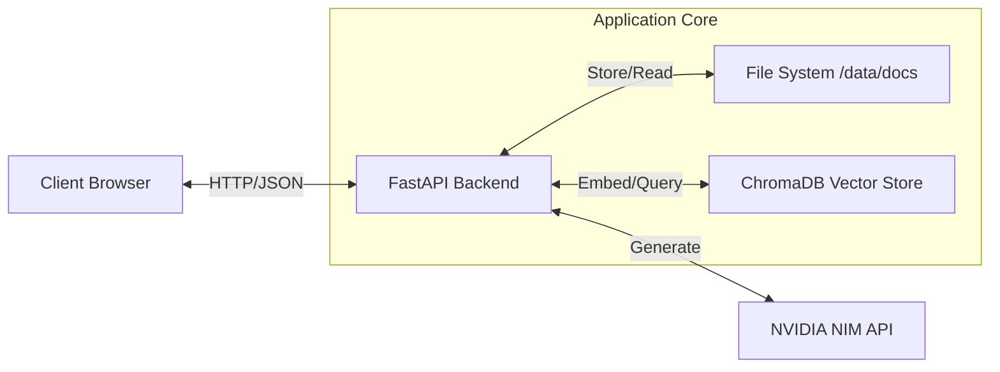

# Private Knowledge Q&A System

A production-ready RAG (Retrieval-Augmented Generation) web application built with FastAPI, ChromaDB, and OpenAI. This system allows users to upload local text documents and ask questions against them, receiving grounded answers based strictly on the uploaded content.

## Features

- **Document Ingestion**: Upload `.txt` files which are automatically chunked and indexed.
- **Vector Search**: Uses NVIDIA Embeddings (`nv-embedqa-e5-v5`) and ChromaDB for semantic retrieval.
- **RAG Pipeline**: Retrieves top 3 relevant chunks to answer questions via Llama-3.1-70b-Instruct.
- **Strict Grounding**: Answers are generated *only* from the provided context.
- **System Health**: Real-time status checks for Backend, Vector DB, and NVIDIA NIM connectivity.
- **Minimal Frontend**: Clean, vanilla HTML/JS interface (no framework overhead).

## Architecture



**Tech Stack:**
- **Backend**: FastAPI, Uvicorn
- **Database**: ChromaDB (Vector Store), Local Filesystem (Document Store)
- **AI/LLM**: NVIDIA `nv-embedqa-e5-v5` (Embeddings), `meta/llama-3.1-70b-instruct` (Chat)
- **Frontend**: Vanilla HTML5, CSS3, JavaScript (Fetch API)

## Implementation Status

| Feature | Status | Notes |
| :--- | :--- | :--- |
| Document Upload | ✅ Implemented | Supports .txt files |
| Vector Indexing | ✅ Implemented | Auto-chunking (1000 chars, 200 overlap) |
| RAG Querying | ✅ Implemented | Returns answer + sources |
| Health Checks | ✅ Implemented | Checks DB and API Key |
| Frontend UI | ✅ Implemented | Upload, Chat, and Status pages |
| Authentication | ❌ Not Implemented | Open access by default |
| File persistence | ⚠️ Partial | Uses local disk (not suitable for ephemeral cloud without volumes) |

## Getting Started

### Prerequisites
- Python 3.9+
- OpenAI API Key

### Local Installation

1. **Clone the repository:**
   ```bash
   git clone <repository-url>
   cd <repository-directory>
   ```

2. **Create virtual environment:**
   ```bash
   python -m venv venv
   source venv/bin/activate  # On Windows: venv\Scripts\activate
   ```

3. **Install dependencies:**
   ```bash
   pip install -r requirements.txt
   ```

4. **Configuration:**
   Copy `.env.example` to `.env` and add your API key:
   ```bash
   cp .env.example .env
   # Edit .env and set OPENAI_API_KEY=sk-...
   ```

5. **Run the application:**
   ```bash
   uvicorn app.main:app --reload
   ```

6. **Access:**
   - Web App: http://localhost:8000
   - API Docs: http://localhost:8000/docs

### Docker Instructions

Build and run the containerized application.

1. **Build Image:**
   ```bash
   docker build -t private-knowledge-qa .
   ```

2. **Run Container:**
   ```bash
   docker run -d -p 8000:8000 --env-file .env --name qa-app private-knowledge-qa
   ```

## Deployment (Render.com)

This application can be easily deployed to Render.

1. **New Web Service**: Connect your GitHub repository.
2. **Runtime**: Select **Python 3**.
3. **Build Command**: `pip install -r requirements.txt`
4. **Start Command**: `uvicorn app.main:app --host 0.0.0.0 --port $PORT`
5. **Environment Variables**:
   - Add `OPENAI_API_KEY`: Your OpenAI key.
   - Add `PYTHON_VERSION`: `3.9.13` (Optional recommended)
6. **Disk (Important)**:
   - Since ChromaDB and uploaded files are stored locally in `/app/data` and `/app/data/docs`, you **must** attach a **Persistent Disk** to `/app/data` on Render (requires paid plan) if you want data to persist across deploys/restarts.
   - *Without a disk, data is lost when the instance restarts.*

## Environment Variables

| Variable | Description | Required |
| :--- | :--- | :--- |
| `NVIDIA_API_KEY` | Your NVIDIA API Key | Yes |
| `NVIDIA_BASE_URL` | Base URL for NIM (default: `https://integrate.api.nvidia.com/v1`) | No |
| `LLM_MODEL` | LLM Model ID (default: `meta/llama-3.1-70b-instruct`) | No |
| `EMBEDDING_MODEL` | Embedding Model ID (default: `nvidia/nv-embedqa-e5-v5`) | No |
